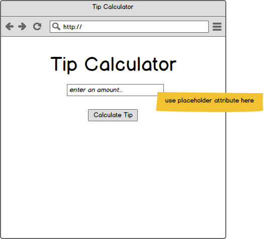
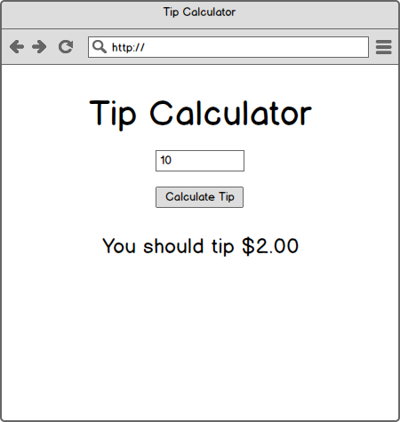
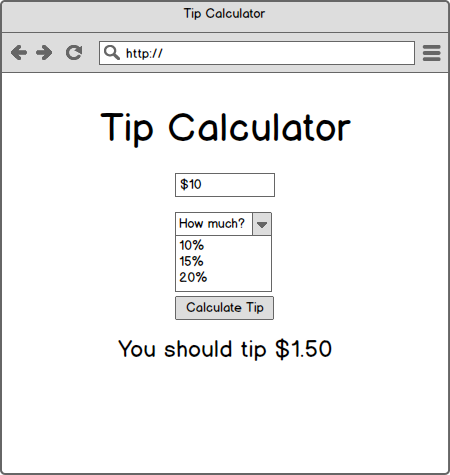

# Problem 1 - Client-side Tip Calculator

## Setup

1. `cd` into this directory and open the directory in your text editor (`atom .`)
1. At the commandline use the `open` command to open the HTML file in Chrome (`open index.html`) - you should see a blank page.

## Problem Description

In this exercise you will work progressively to make a site with the functionality described by the provided [wireframes](https://en.wikipedia.org/wiki/Website_wireframe). For now you may omit CSS/style; your goal is to use the proper event handlers and make the page functional. Appearance of your page is unimportant.

<center>

</center>

Work progressively through the following problems using event handlers:

1. *User can see the correct tip amount when they enter just a number (without a `$`)*

    Write javascript to satisfy the following user story:

        As a user,
        I would like to enter an integer value (`1`, `4`, `65`, etc.), click submit and see the amount for a 20% tip,
        So that I can properly tip my server.

    

    Some test cases to verify your work:

    - When you first load the page, do you see any errors in the JavaScript console? If so, fix them.
    - What happens when you do not enter anything in the tip-amount field, and then click "Calculate"? Do you see an error in the console? Does `undefined` appear anywhere on the page? If so, figure out how to remove that error.
    - Enter amounts like `33` and `45` and `17`.  Do you see more or less than 2 decimals? If so, make sure that you always display all tip amounts to 2 decimals, as specified in the wireframe.
    - Does the `$` appear correctly in the output? If not, go back and look over the wireframe above and make your output match.

1. *User can see the correct tip amount when they enter a number (with a `$`)*

    Update your javascript to satisfy the following user story:

        As a user,
        I would like to enter an integral value with a dollar sign, click submit and see the amount for a 20% tip,
        So that I can properly tip my server.

    Check your work:

    - Does your tip amount change correctly based on the decimals?  For example, is the tip for `$1.00` different from the tip for `$1.80`? If not, you may have `Number` issues.
    - Does your code still work _without_ the `$` and decimals? Does entering an integer like `45` still work? If not, go back and make sure that all previous functionality still works.

1. *User can choose the percent they'd like to tip*

    Update your page to implement this story:

        As a user,
        When I enter a dollar amount I would like to be able to select the percent I would like to tip,
        So that I can tip based on the quality of service.

    

    The dropdown should read "How much?" when the page loads.  If the user enters an amount, and clicks "Calculate Tip" and "How much?" is selected, what do you think should happen? What are some of your options? Pick one and be prepared to defend your decision.

    Check your work:

    - When you enter an amount but don't choose a tip amount, does the page do what you would expect?
    - When you leave the amount blank, and choose a tip amount, does the page do what you would expect?

    If you ever see errors in the console, fix them before committing.

1. *Refactor*

    Recall that a well written function does one thing and does it well. Looking at the code you added using `addEventListener`, reflect on it and ask, "How many things is this function doing?"  Your list may look like this:

    - Find the text field and get its value
    - Find the dropdown and get its value
    - Convert strings to floats where necessary
    - Perform a calculation, being sure to handle errors / edge cases
    - Append the results to the DOM

    Look at your list and ask yourself "which of these have to do with the DOM?" That is, which of those steps read from or modify the current _state_ of the DOM? Next ask, which of those steps is a "pure" (non-stateful) calculation?

    A "pure" calculation is one that has no side effects. For example, if a function clears a text field, then it has changed the state of the DOM and we would say that it has a _side-effect_. If a function simply performs a computation and returns a result, it is said to be a _pure_ function.

    One indicator that a function has side effects is that it lacks the `return` keyword.

    Using these ideas, refactor your code to be a series of functions that separate DOM manipulation (non-pure functions) from computation (pure functions).

    Check your work:

    - Are you doing any arithmetic inside of your `addEventListener` function?
      - If so, the refactor is not complete
    - Are you doing type coercion (`String` to `Number`) in your calculation function?
      - If so, move the type coercion code into the `addEventListener` function
    - Do you have errors in the console at any point? If so, fix them.

## Stretch Goals

* Users see the tip amount update as they type

    ```
    As a user,
    I would like to see the tip amount update as I type,
    So that I feel better about the responsiveness of the page.
    ```

    _hint:_ bind to the `input` event on the text field, and the `change` event for the dropdown
    
* Research and implement using a lightweight templating framework like Handlebars or knockout.js
